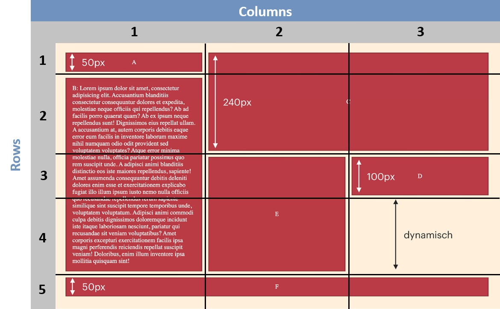
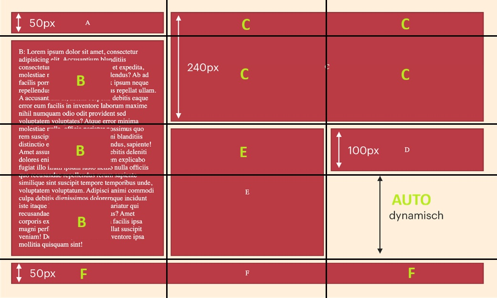
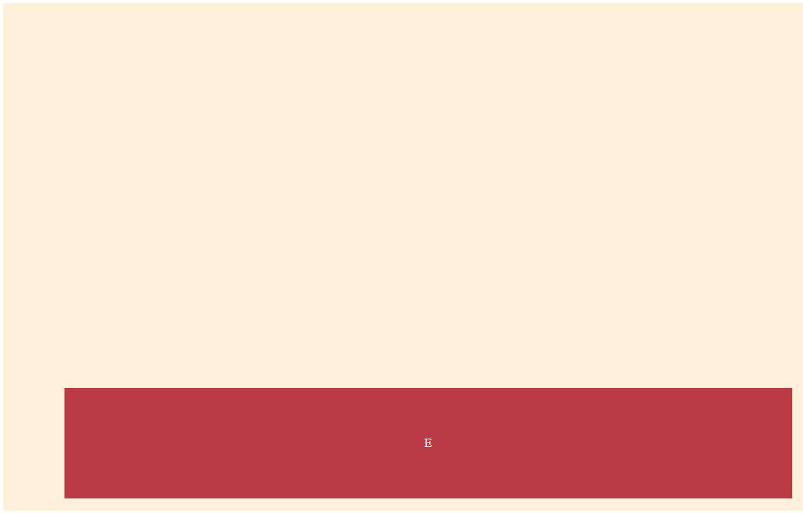
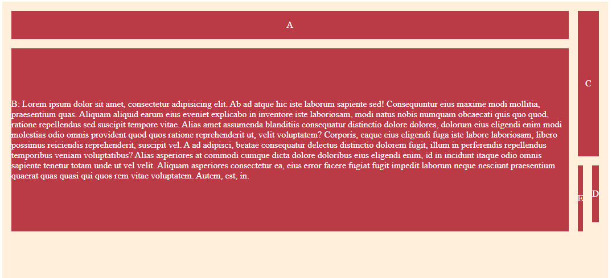
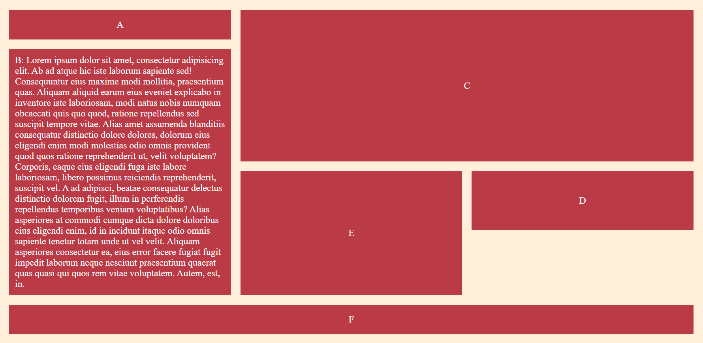
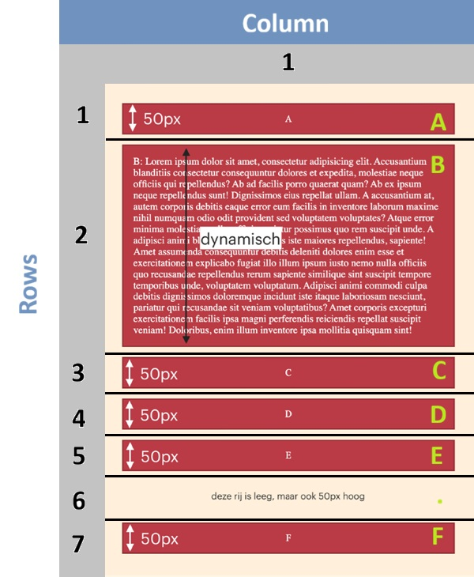

# Responsive grid
**De afstand tussen de elementen is 16px voor zowel de kolommen als de rijen, op zowel desktop als mobiel.**
- gap 16px voor rows en columns
- mobiele versie en desktop versie
---
**Gebruik de afmetingen vermeld op het screenshot om de hoogte van de elementen in te stellen. Let op: deze afmetingen stel je in op de grid-declaratie, niet op individuele elementen zelf.**

---
**Alle kolommen in de desktop-grid hebben "dezelfde" breedte en passen zich aan, aan de breedte van het browserscherm.**

Wat ik eerst dacht:
- elke column heeft geen specifieke breedte en past zich aan de breedte van beeldscherm, het zal auto moeten zijn. 

Wat ik nu weet:
- Je kunt het beste fraction units gebruiken
---
**De lege gebieden zijn ook daadwerkelijk leeg. Je mag hier geen onzichtbare elementen in plaatsen. Wil je weten hoe je omgaat met lege gebieden in een grid? Lees dan het voorbeeld grid-template-areas op CSS Tricks een door om te ontdekken hoe je dit oplost.**
- een '.' telt als lege plek
---

**In blok B staan 150 woorden (tip: typ lorem150 in jouw HTML en druk dan op de tabtoets). Dit blok past zich aan op de content die erin staat.**

---

## Stappenplan
Het is uitdagender om jouw eigen stappenplan te maken en te volgen. Weet je even niet waar je moet beginnen? 🤯 Volg dan onderstaande stappen:

Belangrijk: Leg je PC of laptop even aan de kant en pak er papier en een pen/potlood bij ✏️. Teken bovenstaand plaatje voor Desktops over op papier.
Teken de rasterlijnen over de blokken heen.
Bedenk hoe breed en hoe hoog elke rij en kolom moet zijn, en schrijf dat in 'grid-termen' in je schets.  

*Digitaal is toch makkelijker :)*  

**Rows en columns uittekenen**


**Grid items positioneren**


Oké, je mag weer aan je laptop komen! 💻

Doe even alsof CSS Grid niet bestaat. Maak een simpel container element in grid-opdracht.html met daarin de item elementen. 

```html
<!DOCTYPE html>
<html lang="nl">
<head>
    <meta charset="UTF-8">
    <link rel="stylesheet" href="styles.css">
    <meta name="viewport" content="width=device-width, initial-scale=1">
    <title>Les 3 - Opdracht CSS Grid</title>
</head>
<body>

<div class="container">
    <div class="item-a">A</div>
    <div class="item-b">B</div>
    <div class="item-c">C</div>
    <div class="item-d">D</div>
    <div class="item-e">E</div>
</div>

</body>
</html>
```

Wijs alvast de kleuren toe en zet de letters A - F in de items. Zorg dat de letters netjes in het midden van elk item komen te staan met behulp van flexbox.  

```css
.container {
    background-color: #FFEFDB ;
}
.item-a, .item-b, .item-c, .item-d, .item-e {
    background-color: #BA3B46;
    color: #FFF;
    display: flex;
    justify-content: center;
    flex-direction: row;
    align-items: center;
    row-gap: 16px;
    column-gap: 16px;

}

```

Tijd om het geraamte neer te zetten. Maak van de container een grid-element en beschrijf de grid-template-rows en grid-template-columns aan de hand van jouw schets. 

```css
.container {
    background-color: #FFEFDB ;
    display: grid;
    grid-template-rows: 50px 190px 100px auto 50px;
    grid-template-columns: auto auto auto ;
}

.item-a, .item-b, .item-c, .item-d, .item-e {
    background-color: #BA3B46;
    color: #FFF;
    display: flex;
    justify-content: center;
    flex-direction: row;
    align-items: center;
    row-gap: 16px;
    column-gap: 16px;
}
```

Geef ieder item een grid-area naam  
```css
.container {
    background-color: #FFEFDB ;
    display: grid;
    grid-template-rows: 50px 190px 100px auto 50px;
    grid-template-columns: auto auto auto ;
}

.item-a, .item-b, .item-c, .item-d, .item-e {
    background-color: #BA3B46;
    color: #FFF;
    display: flex;
    justify-content: center;
    flex-direction: row;
    align-items: center;
    row-gap: 16px;
    column-gap: 16px;
}

.item-a {
    grid-area: A;
}

.item-b {
    grid-area: B;
}

.item-c {
    grid-area: C;
}

.item-d {
    grid-area: D;
}

.item-e {
    grid-area: E;
}

.item-f {
    grid-area: F;
}
```

Gebruik deze namen om de items aan de grid toe te wijzen met behulp van de grid-template-areas  
```css
.container {
background-color: #FFEFDB ;
display: grid;
grid-template-rows: 50px 190px 100px auto 50px;
grid-template-columns: auto auto auto ;
grid-template-areas:
'A' 'C' 'C'
'B' 'C' 'C'
'B' 'E' 'D'
'B' 'E' '.'
'F' 'F' 'F'
;
}

.item-a, .item-b, .item-c, .item-d, .item-e {
background-color: #BA3B46;
color: #FFF;
display: flex;
justify-content: center;
flex-direction: row;
align-items: center;
row-gap: 16px;
column-gap: 16px;
}

.item-a {
grid-area: A;
}

.item-b {
grid-area: B;
}

.item-c {
grid-area: C;
}

.item-d {
grid-area: D;
}

.item-e {
grid-area: E;
}

.item-f {
grid-area: F;
}
````
## Probleem
De webpagina werd onjuist weergegeven

Ik checkte mijn webpagina en kwam tot de ontdekking dat het er zo uitzag.



Het eerste probleem is dat ik de waarden in ``grid-template-areas`` verkeerd had ingevoerd. Elke grid-area naam stond tussen ``"`"`` en dat is niet de bedoeling. Alleen aan het begin en eind van elke regel.

```css
.container {
background-color: #FFEFDB ;
display: grid;
grid-template-rows: 50px 190px 100px auto 50px;
grid-template-columns: auto auto auto ;
grid-template-areas:
'A C C'
'B C C'
'B E D'
'B E .'
'F F F'
;
padding:16px;
row-gap:16px;
column-gap: 16px;

}

.item-a, .item-b, .item-c, .item-d, .item-e {
background-color: #BA3B46;
color: #FFF;
display: flex;
justify-content: center;
flex-direction: row;
align-items: center;
row-gap: 16px;
column-gap: 16px;
}

.item-a {
grid-area: A;
}

.item-b {
grid-area: B;
}

.item-c {
grid-area: C;
}

.item-d {
grid-area: D;
}

.item-e {
grid-area: E;
}

.item-f {
grid-area: F;
}
```
[Klik hier voor uitleg over grid-template-areas](https://developer.mozilla.org/en-US/docs/Web/CSS/Reference/Properties/grid-template-areas)

En toen zag mijn webpagina er zo uit. Maar het valt op dat de lege vlak niet aanwezig is zoals in het voorbeeld.



- Ik was item-f vergeten in de html en in de css
- ``grid-template-columns`` stond op `` auto auto auto ``, dat moest ``1fr 1fr 1fr`` zijn  
[Klik hier om te lezen over fraction units](https://developer.mozilla.org/en-US/docs/Web/CSS/Guides/Grid_layout/Basic_concepts#the_fr_unit)

```css
.container {
    background-color: #FFEFDB ;
    display: grid;
    grid-template-rows: 50px 190px 100px auto 50px;
    grid-template-columns: 1fr 1fr 1fr ;
    grid-template-areas:
            'A C C'
            'B C C'
            'B E D'
            'B E .'
            'F F F'
            ;
    padding: 16px ;
    row-gap:16px;
    column-gap: 16px;

}

.item-a, .item-b, .item-c, .item-d, .item-e, .item-f {
    background-color: #BA3B46;
    color: #FFF;
    display: flex;
    justify-content: center;
    align-items: center;
    padding:10px;
}

.item-a {
    grid-area: A;
}

.item-b {
    grid-area: B;
}

.item-c {
    grid-area: C;
}

.item-d {
    grid-area: D;
}

.item-e {
    grid-area: E;
}

.item-f {
    grid-area: F;
}
```

Het resultaat voor de desktop versie



## Code opschonen
Ik ben nog niet klaar en zal de mobiele versie ook nog maken, maar ik merkte dat ik wat herhalingen in de css code zag die ik graag wil wegwerken.

Van
```css
.item-a, .item-b, .item-c, .item-d, .item-e, .item-f {
    background-color: #BA3B46;
    color: #FFF;
    display: flex;
    justify-content: center;
    align-items: center;
    padding:10px;
}
```

naar

```css
.container div {
    background-color: #BA3B46;
    color: #FFF;
    display: flex;
    justify-content: center;
    align-items: center;
    padding:10px;
}
```

Teken nu het plaatje voor Mobiel over op papier. Teken de rasterlijnen over de blokken heen en schrijf de hoogtes en breedtes van de kolommen en rijen erbij.  


Maak een media-query met een breakpoint minimum waarin je Desktops target. (Dit is geen typefout!)  

Verplaats nu het gedeelte van de CSS wat specifiek is voor Desktops naar deze media query.  

Beschrijf buiten de media query een nieuwe grid aan de hand van jouw schets voor Mobiel, door de afmetingen van de grid-template-rows en grid-template-columns te beschrijven.  

Gebruik de huidige grid-area namen om de items aan de grid toe te wijzen met behulp van de grid-template-areas  

Resize jouw scherm en bekijk jouw CSS Grid in actie!

## Opnieuw code opschonen:
- Ik heb de items ook eigen ID's gegeven.
- In CSS heb ik in plaats van ``.container div`` de class ``.item`` van gemaakt, dat is wat specifieker
```css
* {
    margin:0;
    padding:0;
}
/*Mobile*/
.container {
    background-color: #FFEFDB ;
    display: grid;
    grid-template-rows: 50px auto 50px 50px 50px 50px 50px;
    grid-template-columns: 1fr;
    grid-template-areas:
            'A'
            'B'
            'C'
            'D'
            'E'
            '.'
            'F'
            ;
    padding: 16px ;
    row-gap:16px;
    column-gap: 16px;

}

.item {
    background-color: #BA3B46;
    color: #FFF;
    display: flex;
    justify-content: center;
    align-items: center;
    padding:10px;
}

#item-a {
    grid-area: A;
}

#item-b {
    grid-area: B;
}

#item-c {
    grid-area: C;
}

#item-d {
    grid-area: D;
}

#item-e {
    grid-area: E;
}

#item-f {
    grid-area: F;
}

/*Desktop*/
@media (min-width: 576px) {
    .container {
        grid-template-rows: 50px 190px 100px auto 50px;
        grid-template-columns: 1fr 1fr 1fr ;
        grid-template-areas:
            'A C C'
            'B C C'
            'B E D'
            'B E .'
            'F F F'
    ;
    }

}
```